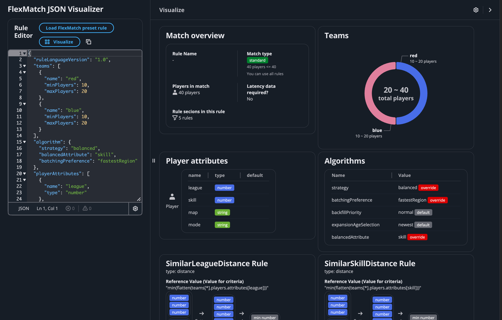

# FlexMatch Rule Visualizer: A tool to visualize Amazon GameLift FlexMatch matchmaking rules.
This app simplifies the process of developing matchmaking mechanisms and accelerates development for developers, designers, and producers.




## Key Features

- Visualization of various types of flexmatch rules
- Interactive rule editing and visualization
- Modern UI using AWS Cloudscape Design System

## QuickStart

1. Execute following commands
   ```bash
   git clone https://github.com/<this repository>/flexmatch-visualizer.git
   cd flexmatch-visualizer
   npm install
   npm run dev
   ```

2. Open `http://localhost:5173` in your browser (port number may vary).

## Security
See [CONTRIBUTING](./CONTRIBUTING.md) for more information.

## License
This library is licensed under the MIT-0 License. See the [LICENSE](./LICENSE) file.